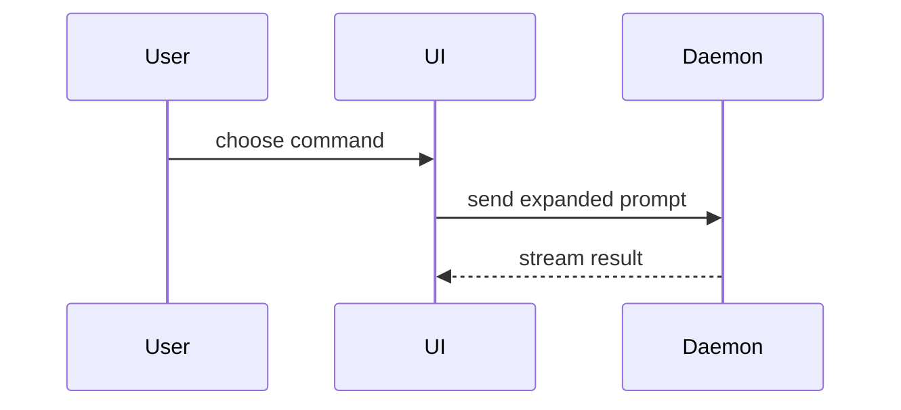

# Show-me examples

Use these shapes only when they clarify the user's question. Keep diagrams focused on the calls, files, props, states, and boundaries that matter.

## Pseudocode

```text
on(save)
  if content is unchanged
    return cached result
  write new content
  return fresh result
```

## Call tree

```text
submitForm
  createSession
    persistPrompt
    launchAgent
  navigateToSession
```

## Component tree

```tsx
<SessionPage> (apps/example/src/routes/session.tsx)
  useSessionEvents()
  <SessionToolbar>
    <RunSkillButton> (packages/ui)
```

## File tree

```text
src/
├── commands/       # parses user actions
├── sessions/       # owns session state
└── transport/      # sends API requests
```

## Mermaid



## Focused HTML

For a visual UI, layout, state comparison, or concept too dense for Mermaid, create one focused HTML artifact only when the user needs it. Use real labels and data, match the product's visual language, and open the artifact after writing it.

## Focused diff

Show only the meaningful change when the surrounding structure is familiar:

```diff
 on(save)
-  write content
+  if content is unchanged
+    return cached result
+  write new content
+  invalidate cache
```

The same form works for file trees, component trees, or call trees. Show the whole block instead when most of it is new, omitted context would hide ownership or order, or the user needs a copyable target shape.
